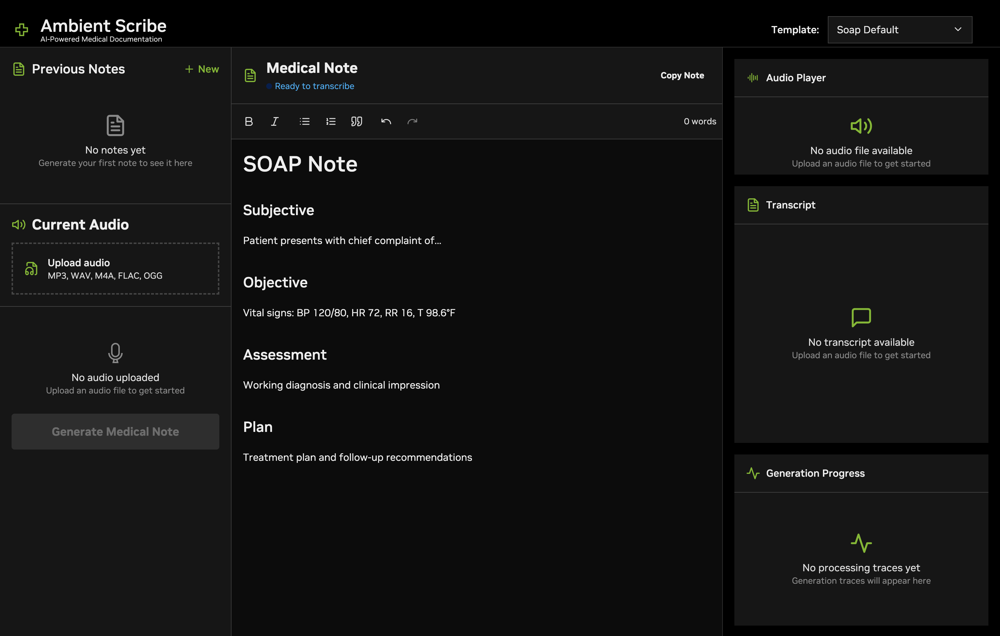

## Table of Contents

- [Ambient Provider](#ambient-provider)
  - [Summary](#summary)
  - [Key Capabilities](#key-capabilities)
  - [System Architecture](#system-architecture)
- [Getting Started](#getting-started)
  - [Prerequisites at a Glance](#prerequisites-at-a-glance)
  - [NGC Account](#ngc-account)
  - [HW Requirements](#hw-requirements)
  - [Docker Installation](#docker-installation)
  - [NVIDIA NIM Deployment](#nvidia-nim-deployment)
  - [Dataset Download](#dataset-download)
  - [Installation](#installation)
- [Using the Platform](#using-the-platform)
    - [Basic workflow](#basic-workflow)
    - [Advanced Features](#advanced-features)
- [Production Deployment](#production-deployment)
- [Best Practices](#best-practices)
- [Troubleshooting](#troubleshooting)
- [Conclusion](#conclusion)


# Ambient Provider

## Overview
Ambient Provider is a comprehensive platform that converts audio recordings of medical consultations into structured clinical notes. The system uses NVIDIA NIM (NVIDIA Inference Microservices) for accurate speech recognition with speaker diarization, combined with reasoning large language models to generate medical documentation.

## Key Features
- **Audio Transcription**: Upload audio files and get accurate transcripts with speaker identification
- **AI Note Generation**: Transform transcripts into structured medical notes (SOAP, Progress Notes, Custom formats)
- **Real-time Processing**: Watch as your notes are generated with live progress updates
- **Professional Editor**: Edit and refine notes with rich text editing and citation support
- **Template System**: Use built-in templates or create custom formats for your practice

## Software Components

The platform consists of three main components working together:

- **Frontend (React)**: Modern web interface for file upload, note editing, and real-time progress tracking
- **Backend (FastAPI)**: Python API server handling transcription orchestration and note generation  
- **External Services**: NVIDIA NIM for speech recognition and NVIDIA API Catalog for reasoning models


# Getting Started
There are two key components to this transcription workflow. 
1) The NVIDIA NIM ASR transcription services with diarization (Parakeet model)
2) The [llama-3.3-nemotron-super-49b-v1](https://build.nvidia.com/nvidia/llama-3_3-nemotron-super-49b-v1) reasoning model. 

This getting started guide will help you set up the necessary hardware and api keys to be able to run the ambient provider developer example.

## Prerequisites at a Glance
The bullet points below highlight an overview of the steps in this getting started guide:
- **Setup NGC account**: Setting up account to download resources
- **Ensure valid HW**: Confirm your system has the required HW
- **Install Docker & NVIDIA Container Toolkit**: Enable GPU support for containers
- **Deploy NIM**: Launch NVIDIA NIM for ASR and diarization
- **Install SW**: Clone the repository and establish environment

## NGC Authentication
Setup an account on [NGC](https://ngc.nvidia.com) using the procedure in the [NGC user guide](https://docs.nvidia.com/ngc/gpu-cloud/ngc-user-guide/index.html). This is needed in order to obtain the necessary NGC API key credentials required to pull the [Riva Speech Skills SDK](https://catalog.ngc.nvidia.com/orgs/nvidia/teams/riva/containers/riva-speech) container and access the cloud api endpoints.

Once your NGC credentials and Cloud account is setup, follow the deatils below to obtain the NGC_API_KEY to be able to access the [NVIDIA API catalog endpoints](https://build.nvidia.com) (AI Models, etc.). 

### Generate an API Key
To access NGC resources, you need an NGC API key:

1. Visit [NGC Personal Key Generation](https://org.ngc.nvidia.com/setup/personal-keys)
2. Create a new API key
3. Ensure "NGC Catalog" is selected from the "Services Included" dropdown
4. Copy the generated API key

### Export the API Key
Make the NGC API key available to Docker:

```bash
# Export the API key (replace <value> with your actual key)
export NGC_API_KEY=<value>

# Make it persistent across sessions
# For bash:
echo "export NGC_API_KEY=<value>" >> ~/.bashrc

# For zsh:
echo "export NGC_API_KEY=<value>" >> ~/.zshrc
```


## Key Requirements

### GPU Requirements

The storage required is 400 GB when self-hosting the LLM NIM. The storage required is 75 GB when using the api catalog LLM NIM.

| Use | Service(s) | Recommended GPU* |
|-----|------------|------------------|
| **Riva ASR NIM** | parakeet-1.1b-en-US-asr-streaming-silero-vad-sortformer | 1 x various options including L40, A100, and more (see nvidia.com) 75GB |
| **Reasoning Model for Note Generation** | nvidia/llama-3.3-nemotron-super-49b-v1 | 2 x H100 325GB or 4 x A100 325GB |
| **Total** | Entire Ambient Healthcare Agent for Providers | 5 x A100 400GBGB or other combinations of the above |

> **Note**: The LLM requirements are based on [NVIDIA's official deployment specifications](https://build.nvidia.com/nvidia/llama-3_3-nemotron-super-49b-v1/deploy?nim=self-hosted).

### Software Requirements
   - Docker & Docker Compose v2.0+
   - Git (for cloning repository)
   - Python 3.13 (required for compatibility with numba and other dependencies)

### API Keys 
   - NVIDIA API Key (from above)

## Prepare Your Machine

### Docker
Install [Docker](https://docs.docker.com/engine/install/) on your system.

### NVIDIA Container Toolkit
Install the [NVIDIA Container Toolkit](https://docs.nvidia.com/datacenter/cloud-native/container-toolkit/latest/install-guide.html#installing-the-nvidia-container-toolkit) to enable GPU support in Docker containers.

After installing the toolkit, follow the instructions in the Configure Docker section in the NVIDIA Container Toolkit [documentation.](https://docs.nvidia.com/datacenter/cloud-native/container-toolkit/latest/install-guide.html#configuring-docker)


### Verify Installation
Test your setup with the following command:

```bash
docker run --rm --runtime=nvidia --gpus all ubuntu nvidia-smi
```

This should produce output similar to:
```
+-----------------------------------------------------------------------------------------+
| NVIDIA-SMI 550.54.14              Driver Version: 550.54.14      CUDA Version: 12.4     |
|-----------------------------------------+------------------------+----------------------+
| GPU  Name                 Persistence-M | Bus-Id          Disp.A | Volatile Uncorr. ECC |
| Fan  Temp   Perf          Pwr:Usage/Cap |           Memory-Usage | GPU-Util  Compute M. |
|                                         |                        |               MIG M. |
|=========================================+========================+======================|
|   0  NVIDIA H100 80GB HBM3          On  |   00000000:1B:00.0 Off |                    0 |
| N/A   36C    P0            112W /  700W |   78489MiB /  81559MiB |      0%      Default |
|                                         |                        |             Disabled |
+-----------------------------------------+------------------------+----------------------+
```


### Docker Login to NGC
Authenticate with the NVIDIA Container Registry:

```bash
echo "$NGC_API_KEY" | docker login nvcr.io --username '$oauthtoken' --password-stdin
```


### Check and Configure Docker Storage Location

Before deploying NVIDIA NIMs, you must ensure your Docker storage is configured on a partition with at least **325 GB** of free space. Insufficient space may cause container downloads or extractions to fail.

#### 1. Check Available Disk Space

Open a terminal and run:

```bash
df -h
```

Look for a partition named `/ephemeral` (or similar) with at least **325 GB** available.

#### 2. Check Docker Storage Location

Check the current Docker data-root by viewing the daemon configuration:

```bash
cat /etc/docker/daemon.json
```

#### If `"data-root"` is **not** set, or is set to a partition without enough space, you need to update this setting.

####x 3. Set Docker "data-root" to a Partition with Enough Space

Open the Docker daemon configuration file:

```bash
sudo nano /etc/docker/daemon.json
```

Add or update the `"data-root"` property so it points to your target partition (e.g., `/ephemeral`). Your file should look similar to:

```json
{
    "default-runtime": "nvidia",
    "mtu": 1500,
    "runtimes": {
        "nvidia": {
            "args": [],
            "path": "nvidia-container-runtime"
        }
    },
    "data-root": "/ephemeral"
}
```

Save the file and exit the editor.

### 4. Confirm the Setting

Re-check the configuration:

```bash
cat /etc/docker/daemon.json
```

Ensure `"data-root"` is correctly set.

### 5. Restart Docker

Apply the changes by restarting Docker:

```bash
sudo systemctl restart docker
```

**Summary:**  
- Ensure `/ephemeral` (or your target partition) has >325 GB free.
- Set Docker `"data-root"` to this partition in `/etc/docker/daemon.json`.
- Restart Docker after saving changes.

This ensures there is enough space for NIM container data and avoids common deployment failures related to storage.


## Quick Start
#### 1. **Clone the repository and setup the virtual environment**:
   ```bash
   git clone <repository-url>
   cd ambientprovider
   
   # Install and pin Python 3.13 (required for numba compatibility)
   uv python install 3.13
   uv python pin 3.13
   
   # Create virtual environment and sync dependencies
   uv venv --clear
   source .venv/bin/activate  # On Windows: .venv\Scripts\activate
   uv sync
   cd ambient-scribe
   ```

> **Note**: If you encounter an error related to `pyaudio` during setup or installation, you may need to install the PortAudio development headers. On Ubuntu, run:
>
> ```bash
> sudo apt-get update
> sudo apt-get install -y portaudio19-dev
> ```

#### 2. Download the medical conversation dataset. 
The dataset example used in this workflow can be obtained from [Hugging Face](https://huggingface.co/datasets/yfyeung/medical) and consists of simulated patient-physician interactions. Download the dataset into a sub-directory called "dataset" that is parallel in scope to the ambient-scribe directory. Be sure to unzip the dataset

#### 3. **Bootstrap the environment**:
   ```bash
   make bootstrap
   ```
   This command:
   - Creates necessary directories
   - Sets up environment files
   - Validates dependencies


#### 4. Deploy Riva and the Ambient Provider

You have two options for deploying NVIDIA NIM:

#### Option 1: RIVA Integrated with Docker Compose (Recommended)
The easiest way is to use the built-in NIM profile that's integrated with the application:

##### **Configure environment variables**:
   ```bash
   # Edit the API configuration
   nano apps/api/.env
   ```
   
   ```bash
   # NVIDIA API Configuration (Required)
   NVIDIA_API_KEY=your_nvidia_api_key_here
   RIVA_URI=parakeet-nim:50051   
 
   OPENAI_BASE_URL=http://llama-nim:8000/v1
   ```

##### **Deploy the dev environment**:

```bash
# Development with local NIM (includes both Riva ASR and LLM)
make dev-nim
```

> **Note**: When using `make dev-nim`, both the Riva ASR and LLM NIM containers will be deployed locally. The LLM NIM container requires significant GPU resources (see hardware requirements above). If you prefer to use the hosted LLM via NVIDIA API Catalog instead of self-hosting, you can still use `make dev-nim` for Riva ASR only and configure your API to use the hosted LLM endpoint.


#### Option 2: Standalone NIM Deployment
Deploy the Parakeet 1.1b English ASR model manually with speaker diarization support:

This option is primarily if you intend to deploy the riva container on a spearate machine as your ambient provider. If you deploy riva outside of the docker network of ambient provider on the same machine, you may experience difficulties communicating between your riva and ambeint provider applications due to firewall rules. 

##### On the separate machine

```bash
# Set container configuration
export CONTAINER_ID=parakeet-1-1b-ctc-en-us
export NIM_TAGS_SELECTOR="name=parakeet-1-1b-ctc-en-us,mode=all,vad=silero,diarizer=sortformer"

# Launch the NIM container
docker run -d --rm --name=$CONTAINER_ID \
   --runtime=nvidia \
   --gpus '"device=0"' \
   --shm-size=8GB \
   -e NGC_API_KEY \
   -e NIM_HTTP_API_PORT=9000 \
   -e NIM_GRPC_API_PORT=50051 \
   -p 9000:9000 \
   -p 50051:50051 \
   -e NIM_TAGS_SELECTOR \
   nvcr.io/nim/nvidia/$CONTAINER_ID:latest
```

If you are self hosting the LLM reasonign NIM as well. Please follow the following documentation. https://build.nvidia.com/nvidia/llama-3_3-nemotron-super-49b-v1/deploy.

##### **Configure environment variables**:
   ```bash
   # Edit the API configuration
   nano apps/api/.env
   ```
   
   ```bash
   # NVIDIA API Configuration (Required)
   NVIDIA_API_KEY=your_nvidia_api_key_here
   RIVA_URI=<YOUR_RIVA_IP>:50051   
   ```

##### **Deploy the dev environment**:

```bash
# Development without local NIM
make dev
```

##### Verify NIM Deployment
Check on the machine with your Riva NIM that the NIM container is running:

```bash
docker ps | grep parakeet
```

You should see output similar to:
```
a1b2c3d4e5f6   nvcr.io/nim/nvidia/parakeet-1-1b-ctc-en-us:latest   "/opt/nvidia/nvidia_…"   2 minutes ago   Up 2 minutes   0.0.0.0:9000->9000/tcp, 0.0.0.0:50051->50051/tcp   parakeet-1-1b-ctc-en-us
```

The NIM will be accessible at:
- **HTTP API**: http://localhost:9000
- **gRPC API**: localhost:50051

> **Note:** After starting the NIM container, check the container logs to ensure you see a message indicating that Riva is running and listening on port 9000. If you do not see this message, the Riva NIM may still be starting up. You can view the logs with:
>
> ```bash
> docker logs -f $CONTAINER_ID
> ```
>
> Wait until you see confirmation that the service is running on port 9000 before proceeding.


#### 5. **Access the applications**:
   - **UI**: http://localhost:5173
   - **API Documentation**: http://localhost:8000/api/docs
   - **Health Check**: http://localhost:8000/api/health

#### 6. **Enable port access**:
   - **Brev**: If your cloud service provider enables exposing a port through the UI lik ein brev, you may specify to expose TCP/UDP traffic to port 5173 for this quick start guide. 
   - **ngrok**: If you cannot expose ports directly, you can use [ngrok](https://ngrok.com/) to create a secure tunnel to your local development environment.

      1. **Install ngrok** (if not already installed):

         ```bash
         sudo snap install ngrok
         ```

      2. **Create an ngrok account**:

         - Go to [ngrok.com](https://ngrok.com/) and sign up for a free account.
         - After signing up, you will receive an **authtoken**.

      3. **Add your ngrok authtoken**:

         Replace `<YOUR_NGROK_AUTHTOKEN>` with your actual token from the ngrok dashboard.

         ```bash
         ngrok config add-authtoken <YOUR_NGROK_AUTHTOKEN>
         ```

      4. **Expose your local port (e.g., 5173 for the UI) using ngrok**:

         ```bash
         ngrok http 5173
         ```

         This will provide a public URL (e.g., `https://xxxx-xx-xx-xx.ngrok-free.app`) that you can use to access your application remotely.


# Using the Platform


## Basic Workflow

1. **Upload Audio File**:
   - Drag and drop an audio file (MP3, WAV, M4A, FLAC)
   - Supported formats are automatically validated
   - Maximum file size: 100MB (configurable)

2. **Transcription Process**:
   - Audio is converted to 16kHz mono WAV format
   - NVIDIA Riva processes with speaker diarization
   - Transcript segments are created with timestamps and speaker tags

3. **Select Note Template**:
   - Choose from available templates:
     - **SOAP Default**: Standard Subjective, Objective, Assessment, Plan format
     - **Progress Note**: For follow-up visits
     - **Custom templates**: Created by your organization

4. **Generate Medical Note**:
   - AI processes the transcript using the selected template
   - Real-time progress is shown with processing traces
   - Note sections are generated and displayed incrementally

5. **Edit and Refine**:
   - Use the rich text editor to modify content
   - Citations automatically link note content to transcript segments
   - Autocomplete suggests content from the transcript

6. **Export and Save**:
   - Copy note to clipboard
   - Save for future reference
   - Export in various formats

## How to Convert Between Streaming and Offline Transcription
To switch between streaming and offline transcription modes, you need to update both the frontend and backend environment configuration files:

1. **Frontend**:  
   - Go into your frontend environment file (e.g., `.env`).
   - Find the setting that enables streaming (e.g., `VITE_ENABLE_STREAMING=true`) and change it to `false`:
     ```
     VITE_ENABLE_STREAMING=false
     ```

2. **Backend**:  
   - Open your backend environment file (e.g., `.env`).
   - Change `ENABLE_STREAMING=true` to `ENABLE_STREAMING=false`.
   - Update the Riva model name to use the offline model by replacing the word `streaming` with `offline` in the `RIVA_MODEL` variable. For example:
     ```
     ENABLE_STREAMING=false
     RIVA_MODEL=parakeet-1.1b-en-US-asr-offline-silero-vad-sortformer
     ```
   - Make sure to restart both the frontend and backend services after making these changes. If you have a dev delopyment the system will restart automatically.

This will configure the system to use offline transcription instead of streaming.

## Use hosted NIM
To use the hosted NIM (NVIDIA Inference Microservice) instead of a self-hosted Riva deployment, you need to update your backend environment configuration:

1. **Set `SELF_HOSTED` to `false`**  
   In your backend `.env` file, change:
   ```
   SELF_HOSTED=false
   ```

2. **Update the Riva Function ID**  
   Replace the `RIVA_FUNCTION_ID` value with the function ID provided by NVIDIA for your hosted NIM instance:
   ```
   RIVA_FUNCTION_ID=your_hosted_nim_function_id_here
   ```

3. **Set the Riva URI to the NVIDIA GRP URL**  
   Update the `RIVA_URI` to point to the NVIDIA hosted endpoint, for example:
   ```
   RIVA_URI=grp.nvidia.com:443
   ```

Make sure to restart your backend service after making these changes for them to take effect.


## Advanced Features

### Customize Riva Deployment

### Word Boosting

Word boosting allows you to bias the ASR engine to recognize particular words of interest at request time by assigning them higher scores when decoding the acoustic model's output. We recommend a boost score in the range of 20 to 100.

#### How to Add Word Boosting to Your Code

In your `transcribe_audio_file` function in `ambient-scribe/apps/api/ambient_scribe/services/asr.py`, add this code after creating the Riva config:

```python
# Configure recognition (existing code)
config = riva.client.RecognitionConfig(
    language_code=settings.riva_language,
    max_alternatives=1,
    enable_automatic_punctuation=True,
    enable_word_time_offsets=True,
    model=settings.riva_model
)

# Add word boosting for medical terms
medical_terms = ["hypertension", "diabetes", "pneumonia", "metformin", "lisinopril"]
boost_scores = [30.0, 25.0, 35.0, 30.0, 35.0]

try:
    config.boosted_lm_words[:] = medical_terms
    config.boosted_lm_scores[:] = boost_scores
    print(f"Word boosting enabled for {len(medical_terms)} terms")
except:
    print("Word boosting not supported by this model")
```

That's it! Now medical terms like "hypertension" will be recognized more accurately instead of being transcribed as "high tension" or similar mishearings.

For more information on customizing NVIDIA Riva ASR—including advanced word boosting, custom vocabulary, and language model adaptation—see the official NVIDIA NIM Riva ASR Customization documentation:

https://docs.nvidia.com/nim/riva/asr/latest/customization.html

This guide covers topics such as:
- Using word boosting and custom vocabulary
- Providing context phrases
- Adapting language models for domain-specific accuracy
- Supported configuration options and API usage

Refer to the documentation above for the latest best practices and detailed examples.


### Template Customization

Create custom templates by adding Jinja2 files to the `templates/` directory:

```jinja2
{# 
Template: Custom Cardiology Note
Description: Specialized template for cardiac consultations
Sections: chief_complaint, history, examination, assessment, plan
#}

# Cardiology Consultation

## Chief Complaint
{{ chief_complaint or "No chief complaint documented" }}

## History of Present Illness
{{ history or "No history documented" }}

## Physical Examination
### Cardiovascular
{{ cardiovascular or "No cardiac examination findings" }}

## Assessment
{{ assessment or "No assessment provided" }}

## Plan
{{ plan or "No treatment plan documented" }}
```

# Develop From Source

Currently, running from source assumes you have a riva deployment url on your machine that you will point to directly in the .env file.

This functionality is not currently supported on brev. 

## Install uv (if not already installed)

```bash
# Install uv (Python package manager)
curl -LsSf https://astral.sh/uv/install.sh | sh
# Or on macOS: brew install uv
```

## Setup Virtual Environment

```bash
# Python API (requires Python 3.13+)

# Install and pin Python 3.13
uv python install 3.13
uv python pin 3.13

uv venv --clear
source .venv/bin/activate  # On Windows: .venv\Scripts\activate
uv sync
```

## Run Development Servers
```bash
# API Server (from ambient-scribe root)
make dev-api
# Runs on http://localhost:8000

# UI Server (from ambient-scribe root) 
make dev-ui
# Runs on http://localhost:5173
```

# Production Deployment

## Production Setup

####  1. **Build production images**:
   ```bash
   make build
   ```

#### 2. **Start production services**:
   
   **Option A: With external Riva (default)**:
   ```bash
   make up
   ```
   
   **Option B: With local NIM container**:
   ```bash
   make up-nim
   export RIVA_URI=parakeet-nim:50051
   ```

> **Note:** If you are accessing the API or UI remotely (e.g., via ngrok or a cloud provider), ensure that the relevant ports (such as 8000 for the API and 5173 for the UI) are properly exposed and allowed through your firewall, CSP, or tunneling service.

> **Note:** When deploying Riva NIM, always check the container logs to confirm that the service has started up successfully and is running without errors. This helps diagnose issues early if the API server cannot connect to the ASR backend.

## Comprehensive Make Commands

```bash
# Environment & Setup
make bootstrap    # Initialize the application
make env         # Copy environment template
make reset       # Clean and reinitialize everything

# Development Commands
make dev         # Start development environment (external Riva)
make dev-nim     # Start development environment with local NIM
make dev-logs    # Follow development logs
make dev-logs-nim # Follow development logs (with NIM profile)
make dev-down    # Stop development environment
make dev-down-nim # Stop development environment (with NIM profile)

# Development & Testing  
make fmt         # Format code (API: black/isort, UI: prettier)
make lint        # Run linters (API: ruff/mypy, UI: eslint)
make test        # Run tests for both API and UI

# Production Management
make build       # Build Docker images
make up          # Start production environment (external Riva)
make up-nim      # Start production environment with local NIM
make down        # Stop production environment
make down-nim    # Stop production environment (with NIM profile)
make restart     # Restart production services
make restart-nim # Restart production services (with NIM profile)

# Monitoring & Debugging
make logs        # View production logs
make logs-api    # View API logs only
make logs-ui     # View UI logs only  
make health      # Check service health
make ps          # Show running containers
make top         # Show container resource usage

# Utilities
make clean       # Clean up containers and volumes
make backup      # Backup application data
make shell-api   # Open shell in API container
make shell-ui    # Open shell in UI container
```

# Troubleshooting
## Common Issues

**Transcription fails with "NIM connection error"**:
- Verify NIM container is running: `docker ps | grep parakeet`
- Check that NIM is accessible: `curl http://localhost:9000/v1/health`
- Ensure RIVA_URI is correctly configured to point to NIM gRPC endpoint (localhost:50051)
- Verify NGC_API_KEY is properly set and exported

**Note generation times out**:
- Check NVIDIA API key validity
- Verify network connectivity to NVIDIA API
- Consider shorter audio files or chunking

**Frontend not loading**:
- Ensure all services are running: `make health`
- Check browser console for errors
- Verify port 5173 is accessible

**Audio upload fails**:
- Check file format is supported
- Verify file size is under limit
- Ensure sufficient disk space

# Security Considerations
Please be aware of the following security considerations when using this repository:

- **Credential Management:** Never hard-code sensitive credentials (API keys, passwords, etc.) in code or configuration files. Use environment variables or a secrets manager.
- **NGC API Key:** The application requires and processes an NVIDIA NGC API key. Treat your key as sensitive; do not expose it publicly or commit it to source control.
- **Network Exposure:** By default, several services run locally and may expose network ports. Restrict access with firewalls or Docker network settings as appropriate for your environment.
- **User Data Protection:** Uploaded audio files and generated medical notes may contain personally identifiable information (PII) or protected health information (PHI). Ensure secure storage and proper data handling in accordance with applicable regulations (e.g., HIPAA, GDPR).
- **Dependencies:** Review all dependencies and container images for known vulnerabilities. Keep your dependencies up to date.
- **Container Security:** Do not run containers with unnecessary privileges. Use the least privilege principle.
- **Vulnerability Reporting:** If you discover any security issues or vulnerabilities in this repository, please follow the reporting instructions in the [SECURITY.md](./SECURITY.md) file.

For more information, see the [SECURITY.md](./SECURITY.md) file in this repository.


# Conclusion

Ambient Provider provides a complete solution for converting medical conversations into structured clinical documentation. The platform combines the power of NVIDIA's speech recognition technology with advanced AI reasoning to create accurate, professional medical notes.

The modular architecture allows for easy customization and extension, while the Docker-based deployment ensures consistent behavior across different environments. Whether you're processing a single consultation or building a larger healthcare documentation workflow, Ambient Scribe provides the tools and flexibility you need.
